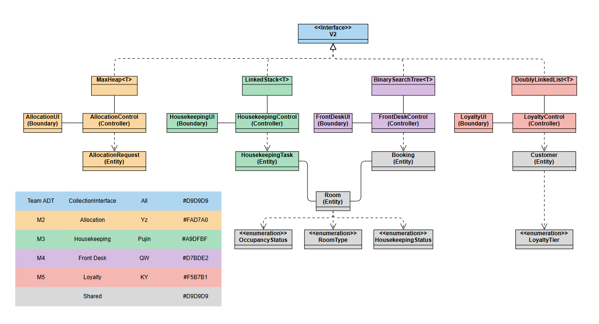

# Project Description

> - A **console-based prototype system** for TAR UMT Resorts 
> - Full CLI, we don't do GUI
> - **Must implement `Interface`**

## Modules Break Down

> Total 5 modules (M1 dropped)

| *No.* | *Modules* | *Implementation (of team ADT)* | *Assigned to* | *Reason* |
|------|---|---|---|---|
| M2 | VIP & Loyalty Tier-Priority Room Allocation | `MaxHeap` | YZ | not covered in the course (originality marks); insert reorganizes automatically so the highest priority is always at the root — exactly the spec wording; priority = static key `tier*W - arrivalSeq*r`, so waiting-time aging needs no re-heapify |
| M3 | Housekeeping and Task Log | 2 * LinkedStack | Pujin | LIFO matches undo semantics; O(1) push/pop = spec's "roll back instantly"; second stack enables redo (cleared on new action) |
| M4 | Front-Desk Service | Binary Search Tree (BST) / harder: AVL Tree | QW | tutor advised against hash; O(log n) search on the unique comparable confirmationNo; in-order traversal gives a sorted listing for free |
| M5 | Loyalty and Rewards Service | Doubly Linked List | KY | no single dominant operation -> general-purpose collection; O(1) insert/remove after locating + two-way traversal, supports the many member features |
| M6 | Summary Reports | - | All Members | algorithms instead of a new ADT: each member hand-writes one sort + search/filter for their own module's report |

> M1 Walk in Registration drop

## Team ADT Design

> 这是团队组件的核心交付物。ADT = interface + operation contracts，与存储方式无关——我们交的是一个**自创的 collection ADT**（Q&A 原话背书: "You may even create your own collection ADTs"），originality 的 "not covered in the course" 直接是字面事实

### The Interface

- Name: `CollectionInterface<T>`（meeting 14-07 暂定，报告定稿前可再议）——中性可复用，不绑定 resort 业务（Q&A 强调 reusability）
- Interface 类头写**全组四人**为共同作者——"全员商量出一个公用接口" 的书面证据

```java
/**
 * Team ADT — a policy-ordered collection.
 * Each implementation defines its own organizing policy, which determines
 * the meaning of "first"/"last" and the traversal order.
 * Authors: all
 */
public interface CollectionInterface<T extends Comparable<T>> {

    // ---- insertion ----
    boolean add(T newEntry);      // insert under this implementation's organizing policy

    // ---- removal ----
    T remove();                   // remove & return the POLICY-FIRST element; null if empty
    boolean remove(T anEntry);    // locate & remove a specific element; false if absent
    void clear();

    // ---- access / query ----
    T getFirst();                 // policy-first element, no removal; null if empty
    T getLast();                  // policy-LAST element, no removal; null if empty
    T search(T probe);            // stored element with compareTo(probe) == 0; null if absent
    boolean contains(T anEntry);

    // ---- status ----
    int size();
    boolean isEmpty();

    // ---- traversal ----
    Iterator<T> getIterator();    // iterates in this implementation's policy order
}
```

> 实现类别名允许（e.g. `LinkedStack` 加 `pop()` 一行 delegate 到 `remove()`——JDK `Deque.pop()` 同款写法），但只加自己 control 真会调用的，报告规格里只写接口名

### Policy Table

> `remove()` / `getFirst()` 的契约措辞是整个设计的关键：**"removes/returns the element designated FIRST by the implementation's organizing policy"** —— 一句话容纳四种语义。JDK 的 `java.util.Queue` javadoc 就是同一写法（LinkedList = FIFO, PriorityQueue = priority order），demo 时可引用

| Implementation | policy-first element | `add(...)` does |
|---|---|---|
| `MaxHeap` (M2) | highest priority | sift-up |
| `LinkedStack` (M3) | most recently pushed | push |
| `BinarySearchTree` (M4) | smallest key | BST insert |
| `DoublyLinkedList` (M5) | head | append |

### 铁律

1. **依赖最小契约**（面向接口编程的真实含义，不是"所有变量都接口类型"）：
  - 自己模块拥有的集合**字段可以用具体类**（e.g. `private MaxHeap<Allocation> queue`）——不然 add-on 方法访问不到
  - 一切不需要 add-on 的**方法参数**和**共享代码**（M6 报表、utility）一律收接口类型：`void printReport(CollectionInterface<?> c)` —— 一个方法吃遍四个实现，这才是"面向接口编程"的加分证据，demo 时可现场换实现类
  - **永不 downcast**（`(MaxHeap<T>) c` 这种一律禁止）
2. Add-on public methods on implementation classes are **allowed & encouraged**（Q&A: "team's collection ADT with add on methods"），e.g. M4 的 `rangeSearch`
3. ADT Specification document (report Part A 1.1): 包含**全部 basic operations** 即使模块用不到 + `getIterator()` 要进规格（`hasNext`/`getNext` 不进，它们属于 Iterator）+ **零实现细节**（rubric 明文：含实现细节最多 Approaching）

## Timeline

> Submission Date: Week 10 Friday 11.59 pm.

- Freeze shared data contracts (Booking fields, Room Status, tier values): Week 3
- Code Writing: Week 3 - Week 8
- Early Code Integration: Week 6
- Final Code Integration & Documentation (NetBeans project + ReadMe.txt): Week 9
- Last Checking: Week 10
- Demo Prep (each member: own ADT reasoning + complexity): Week 10 - Week 11

## Spec Compliance Checklist (for report / code review)

- [ ] **No Java Collections Framework**: never use `java.util` ArrayList / HashMap / LinkedList / Stack etc.; `java.util.Iterator` and `Comparator` are OK (Q&A confirmed); `Collections.sort()` 禁用——排序自己写
- [ ] ADTs not written by you / adapted: **acknowledge the source** at the top of the Java interface (spec requirement)
- [ ] Author name as a comment at the top of every class you wrote; interface 类头写全组
- [ ] Utility classes may contain static methods + static variables only (check InputHelper / OutputHelper)
- [ ] ECB constraints: Boundary <-> actor/control; Control <-> boundary/entity/other controls; **Entity may only know other entities**
- [ ] Entity classes are POJOs: no I/O statements; **override `toString`, `equals`, `compareTo`**（Q&A：不 override 有些 ADT 方法会出错）
- [ ] Only validations that invoke ADT methods are required (spec wording); UI earns no marks — don't over-invest
- [ ] Creative features must **invoke ADT operations** to count (rubric wording)
- [ ] Deliverables: NetBeans project + data files + ReadMe.txt + AI Usage Disclosure Form
- [ ] AI policy is Yellow: no AI-generated modules/core code; write core ADT + module logic yourself and be able to explain every line at the demo
- [ ] Team component submits **ONE ADT = our self-defined interface**: Part A 1.1 = ADT specification, Part A 1.2 = interface source + implementation class source
- [ ] **CLO2 needs ≥ 40/100 to pass the coursework**（rubric note）
- [ ] Java naming convention (Camel Case)

---

# Project Structure

## ECB

> Make it as Entity-Control-Boundary (ECB) architecture

- ECB (Entity-Control-Boundary) — a pattern that splits the system into three layers:
    - Boundary: UI layer. Performs user I/O handling and interacts with the user.
    - Control: Logic layer. Handles business logic and coordinates the workflow.
    - Entity: Data layer. Stores the data and the data structure operations.

- Flow: Boundary -> Control -> Entity

- ECB Architecture UML

```
                                 ┌─────────────────┐
                                 │ Utility Classes │
                                 └─────────────────┘
                                          │
                                      used by
                                          │
         ┌────────────────────────────────┼──────────────────────────────┐
         │                                │                              │
         │                                │                              │
┌──────────────────┐             ┌─────────────────┐             ┌────────────────┐
│ Boundary Classes │ ──access──> │ Control Classes │ ──access──> │ Entity Classes │
└──────────────────┘             └─────────────────┘             └────────────────┘
```

## File Structure

> Notes: The naming is just for reference, free to change it if you want to

```
src/
├── Main.java          // Entry point
├── adt/               // Team ADT interface (CollectionInterface) + 4 implementations
├── entity/            // Data classes (Serializable)
├── boundary/          // UI layer - console I/O only
├── control/           // Logic layer - business rules, module menus, reports
├── dao/               // Hardcoded seed data to RAM (incl. bookings — M1 dropped)
└── utility/           // Static-only helpers
```

## 数据归属：DAO 私有，Control 共享

跨模块拿数据只有一条路：

```
自己的 DAO ──> 自己的 Control ──> 别的模块
```

三条规则：

1. **一个 DAO 只被它自己模块的 control 读。** 不要 `new 别人的DAO()`。
   M2 要 booking，就跟 `BookingControl` 要，不碰 `BookingDAO`。
2. **每个模块的 control 全程只有一个实例**，在 `Main` 里 `static final` 建好，
   往下注入给 UI 和需要它的其他 control。
3. **Control 在构造函数里从自己的 DAO 播种一次**，之后集合就归它管。

第 2 条不是可选的。对象唯一靠 DAO 的 `static` 数组就够了，但**集合**唯一只能靠
单实例——两个 `BookingControl` 各自有一棵 BST，M4 新增一张 booking，M2 那棵树里
没有，照样不同步。顺带一个好处：退出菜单再进来，模拟时钟和队列不会被重置。

当前接线（`Main`）：

```java
private static final BookingControl BOOKINGS = new BookingControl();
private static final AllocationUI ALLOCATION_UI =
        new AllocationUI(new AllocationControl(BOOKINGS));
```

`control/BookingControl.java` 是 YZ 写的**占位**，内部先用数组；QW 换成 BST，
保留 `getAllBookings()` / `findByConfirmationNo()` 两个方法名，要改先说。

`LoyaltyControl` 同理：构造函数里 `new MemberDAO().getAllMembers()` 播进
`DoublyLinkedList<Member>`，**不要自己 `new Member(...)` 造一批新的**——那样
M5 给客人升级，M2 队列里读到的还是旧 tier，重排功能直接失效。

## Shared Data Definitions (共享数据定义)

> 下面每一条都至少有第二个模块在读，改之前先在群里说一声。
> 只列**跨模块要知道的**字段——模块内部字段（积分明细、账号密码等）不写进来。

### Room

- who handle: module 3 (housekeeping) (pujin)
- read by: module 2 (allocation)
- fields: `roomNo, roomType, occupancyStatus, housekeepingStatus`
- ⚠️ 两处待改：`roomType` 由 `String` 改成 `RoomType` enum；补一个 `setOccupancyStatus`

### Room Status

- occupancy: `Available, Reserved, Occupied, Out-of-Service`
  - `Reserved` = 已分房、客人还没到。没有这个值，M2 判断不出房已被占，**同一间房会被分配两次**
- housekeeping pipeline (spec wording): `Dirty, Cleaning In Progress, Inspected, Ready for Check-In`
- M2 只在 `Available` **且** `Ready for Check-In` 时才分配该房

### Room Type

- data + 每晚房价（RM）：`SINGLE 200.00`、`DELUXE 350.00`、`SUITE 700.00`
- 故意不等距——等差的话 revenue 排名恒等于 occupancy 排名乘一个常数，M6 报表就算不出东西了

### Booking / Reservation

- who handle: `dao/` seed data（M1 dropped，spec 允许 hard-coded entity values）
- read by: module 4 (front-desk), module 2 (allocation), report
- fields: `confirmationNo, member, roomType, room, checkIn, checkOut, status`
  - `member` — `Member` 引用；姓名走 `getMember().getName()`，不另存一份
  - `roomType` — 客人**要求**的房型（营收按这个算，不是按分到的房）
  - `room` — **nullable**，`null` = 尚未分房，由 M2 写入
  - `checkIn` / `checkOut` — `LocalDate`（M6 要算住了几晚，存 String 就算不了）
- `compareTo` 按 `confirmationNo`——M4 的 BST 键，**锁死不改**
- `confirmationNo` is an 8-digit number, generate randomly (sequential keys would degenerate M4's BST into a linked list)

### Booking Status

- who handle: `dao/` seed data 播种，之后由 module 4 写
- data: `Pending, Confirmed, Checked-in, Checked-out, Cancelled`
- **M2 分房不改 status**（分房 ≠ 入住）；只有 `Confirmed` 且 `room == null` 的 booking 进 M2 的队列

### Confirmation Number

- who handle: `dao/` seed data
- read by: module 4 (front-desk) for BST search (O(log n) average)
- format: 8-digit numeric, unique -> e.g. `10042087`

### Member

- who handle: module 5 (loyalty) (ky)
- read by: module 2 (allocation) for tier priority
- 公用 fields: `memberID, name, currentTier`
- 非会员也是一个 `Member`，`currentTier = GUEST`——单一实体，不引入 null

### Member ID

- who handle: module 5 (loyalty) (ky)
- format: `M` + 5 digits，由 `Member` 用一个 static 计数器生成 -> `M00001`, `M00002`, ...
- **终身不变**：入会/升级只改 `currentTier`。换 ID 会让所有指向他的 booking 全部失效
- ⚠️ 具体数值取决于构造顺序，**种子数据里不要写死 memberID**，用 `MemberDAO.findByUsername(...)`

### Loyalty Tier

- who handle: module 5 (loyalty) (ky)
- read by: module 2 (allocation) for priority ordering
- 类型：`entity.LoyaltyTier`（顶层 enum）
- data + 权重：`GUEST 0, SILVER 30, GOLD 60, PLATINUM 90`
- **权重的单位是分钟**：aging 速率 k = 1 分/分钟，所以「每升一级 = 抵 30 分钟的等待」
- ⚠️ 不要和 `entity.Tier` 搞混——那是 M5 的**每季度积分记录**（`loyaltyTier, season, seasonalPoints`），
  是一条历史，不是等级本身

### Allocation（M2 内部，列在这里供集成参考）

- who handle: module 2 (allocation) (yz)
- fields: `booking, special, arrivalMinute, seq, invariantPriority`
- `SpecialCategory`：`NONE 0, GOODWILL 10, HABITABILITY 20, COMPLIANCE 30, LIFE_SAFETY 40`
- 排序三层：`special 权重` → `invariantPriority`（仅两边都是 NONE 时） → `seq` **反向**（先到先得）
- `invariantPriority = tier 权重 − arrivalMinute`，control 在 `add()` 前算好，此后不重算
- 时钟是**可手动推进的模拟时钟**，不是墙上时间——真实时钟下 demo 全程只有几分钟，交叉点演示不出来

### 字段写入权

| 字段 | 谁写 | 谁读 |
|---|---|---|
| `Booking.room` | M2 | M4, M6 |
| `Booking.status` | M4 | M2, M6 |
| `Room.occupancyStatus` | M2 (→Reserved)、M4 (→Occupied/→Available)、M3 (↔Out-of-Service) | M2 |
| `Room.housekeepingStatus` | M3 | M2 |
| `Member.currentTier` | M5 | M2 |

- check-out 后房间要变脏：M4 的 control 调用 M3 的 `HousekeepingControl.markDirty(room)`。
  control 调 control 是 ECB 允许的，**不要绕过去直接 setter**

### Format Conventions

- Room No.: `zone-floorRoom` -> e.g. `A-1203`
- Date: `dd-MM-yyyy` -> e.g. `26-06-2026`（**显示格式**；存储用 `LocalDate`）
- Money: `RM` + 2 decimals floating point number -> e.g. `RM 250.00`

# Implementation Details

## Menu Design

### Main Menu

```
=== TARUMT Resorts ===
(^_^)/ Welcome!

[0] Exit
[1] Vip & Loyalty Tier-Priority Room Allocation
[2] Housekeeping and Task Log
[3] Front-Desk Service
[4] Loyalty and Rewards Service

Please Select > 
```

> modules 的 menu 你们自己设计

### 一点小设定

> 有意见可以提

- use `===` to wrap title
    - e.g. `=== VIP & Loyalty Tier-Priority Room Allocation ===`
- use `[n]` for option
- must provide `[0]` for exit/go back
- use `>` for prompt

## Class Diagram

### Analysis Phase


